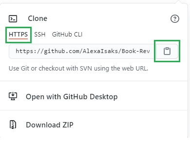
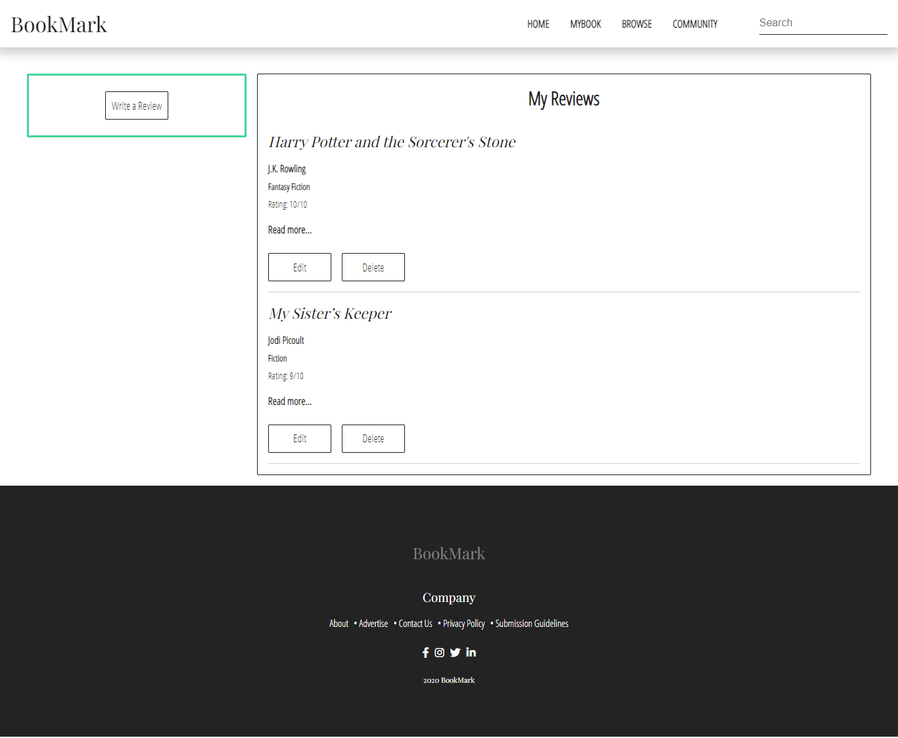
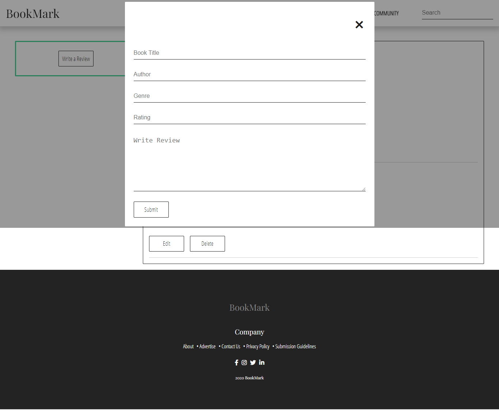
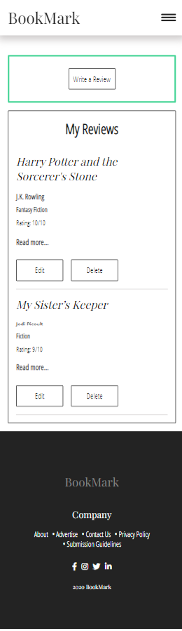
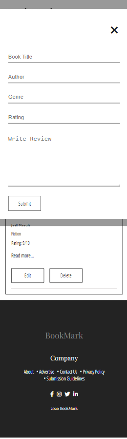

<h1 align="center">Book Review</h1>

A webpage that allows you to add, edit and delete book reviews.

## Table of Contents

* [About the Project](#about-the-project)
* [Installation](#installation)
* [Usage](#usage)
* [Acknowledgments](#acknowledgments)

## About the Project

 

  

The task's focus points:

* JavaScript
  - DOM manipulation
  - Handeling forms (book review form)
  - Creating Objects
  - Editing and deleting book reviews
  - Session and Local Storage

## Installation

* Select the green **Code** button  

  

* Select HTTPS and copy the URL 

   

* Open Git Bash.
* Change to the directory/folder where you want to clone the repository.
* To clone the repository, type `git clone` followed by the URL. 

  `$ git clone https://github.com/AlexaIsaks/Book-Review.git`

* Press **Enter**. The repository will be cloned in your folder.

## Usage

* Open the Book-Review folder in your favourite code editor and click on the `index.html` file.

* View the index.html using a live server. There are various extensions found on the Visual Studio Code Marketplace. 

* The webpage should look like this:

## Acknowledgments

**HyperionDev**

Certified Full Stack Web and Software Engineer 

**Webpage design inspired by:**

[BookPage](https://bookpage.com/reviews)
